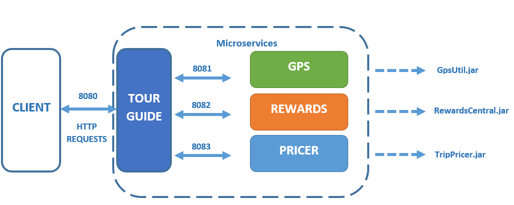
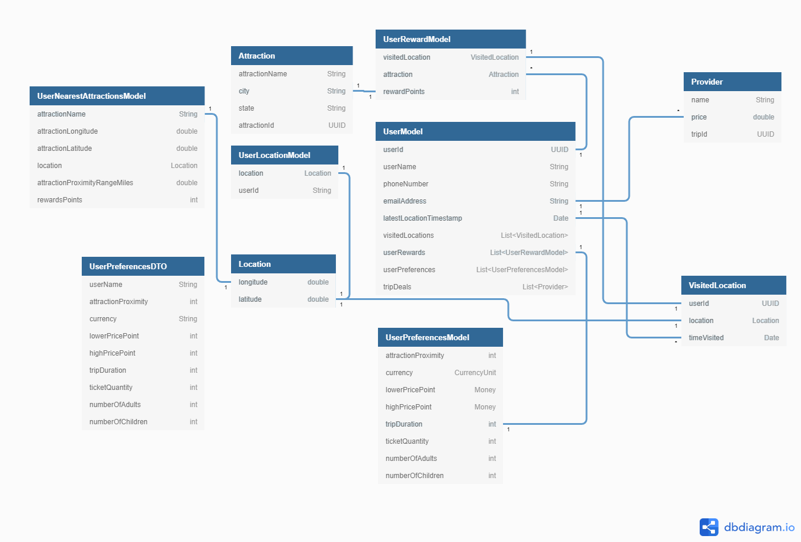

 * * *    * * *   * * * [](https://www.sphinx-doc.org/)

# P8-TOURGUIDE
Project 8 - OpenClassrooms- Scale Up Your App With Distributed Systems - ALEXANDRE DUBOIS

## Purpose
TourGuide is a Spring Boot application that has been a centerpiece in the TripMasters app portfolio. 
The application will be targeting people looking for package deals on hotel stays and admissions to various attractions. 

It now supports the tracking of 100.000 users in a bit more than 3 minutes and the calculation of reward points for 100.000 users in +-8,5 minutes.
As it is now, TripMaster can even go up to 235.000 users, under the requirements of 15 and 20 minutes each set at the beginning of the project's construction (for tracking locations and rewards).

## Architecture Overview
Below, you can find the architecture Overview of TourGuide:



## Domain layer Overview
All the different fields are represented here-under on this diagram:



## Prerequisites to run
- Java 1.8 JDK
- Gradle 4.8.1
- Docker


## Installing
1. Install **Java**: https://www.oracle.com/java/technologies/javase-downloads.html

2. Install **Gradle**: https://gradle.org/install/

3. Install Docker Desktop:
https://docs.docker.com/docker-for-windows/ or https://docs.docker.com/docker-for-mac/

## Technical Specifications

TourGuide is composed of 4 microservices:
1. **TourGuide**
https://github.com/ALEXD2758/P8-TOURGUIDE.git
2. **Gps-Util**
https://github.com/ALEXD2758/P8-TOURGUIDE-GPSUTIL.git
3. **Rewards Central**
https://github.com/ALEXD2758/P8-TOURGUIDE-REWARS-CENTRAL.git
4. **Trip Pricer**
https://github.com/ALEXD2758/P8-TOURGUIDE-TRIPPRICER.git

## Run the application


- **WITH IDE/GRADLE**: Change the BASE_URL present in files GpsUtilWebClient/RewardsWebClient/TripPricerWebClient in folder src/main/java/tourGuide/webclient/ to: "http://localhost:+PORT". For running the application, either launch it in your IDE or run below command inside the root directory of the 4 microservices:
```
$ ./gradlew bootRun
```
- **WITH DOCKER**: Use this exact procedure: 
> 1. Build your application with gradle
```
$ ./gradlew build
```
> 2. Build docker images for each microservice. In each microservice root directory, launch the following command:

```
$ docker build -t NAME_OF_YOUR_IMAGE:TAGVERSION .
```
> 3. Go back into P8-TOURGUIDE root directory and launch this command, which is going to launch and compose the Docker containers from images previously created, but also run then.
You will then see all applications running with Spring Boot.

```
$ docker-compose up
```

**GOOD TO KNOW:** Compose is a tool for defining and running multi-container Docker applications. With Compose, you use a YAML file to configure your application's services. 
Then, with a single command, you create and start all the services from your configuration. ... 
Run docker-compose up and Compose starts and runs your entire app.

## Endpoints

> **GET** - Index
http://localhost:8080/

> **GET** - Start Tracker - for development
http://localhost:8080/location/startTracker

> **GET** - Stop Tracker - for development
http://localhost:8080/location/stopTracker

> **GET** - Get user location
http://localhost:8080/getLocation
**OBLIGATORY parameter**: userName

> **GET - Get nearby attractions (defined as 5 at the moment)
http://localhost:8080/getNearbyAttractions 
**OBLIGATORY parameter**: userName

> **GET - Get all current locations of every user
http://localhost:8080/getAllCurrentLocations

> **GET - Get reward points for a user
http://localhost:8080/getRewards 
**OBLIGATORY parameter**: userName

> **GET - Get trip deals for a user
http://localhost:8080/getTripDeals 
**OBLIGATORY parameter**: userName

> **PUT - Update the user Preferences for a specific user
http://localhost:8080/update/Preferences
**OBLIGATORY body**: userPreferencesDTO (attractionProximity, currency (as currency unit, ex: "USD"), lowerPricePoint, highPricePoint, tripDuration, ticketQuantity, numberOfAdults, numberOfChildren)
**OBLIGATORY parameter**: userName

## Testing
TourGuide has a full integration and unit test suite. You can launch it with the following command:

```
$ ./gradlew test
```

Or for running the tests inside your IDE, follow the link below:
[Work with tests in Gradle](https://www.jetbrains.com/help/idea/work-with-tests-in-gradle.html#configure_gradle_test_runner).

## Reporting
JaCoCo reporting tools are attached to the gradle configuration. Launch these 2 commands to run the tools:
```
$ ./gradlew jacocoTestReport
```
```
$ ./gradlew jacocoTestCoverageVerification
```

## Metrics
Through the class called TestPerformance, containing two methods, we are able to monitor the metrics of gpsUtil and rewardsCentral efficiently according to the time, in minutes, that we set in the test. Both tests will be performing the creation of an internal user map with the number of users wanted and then starting to track the location or calculate the rewards of each user.
These tests can be modified to suit new solutions, just as long as the performance metrics at the end of the tests remains consistent.
